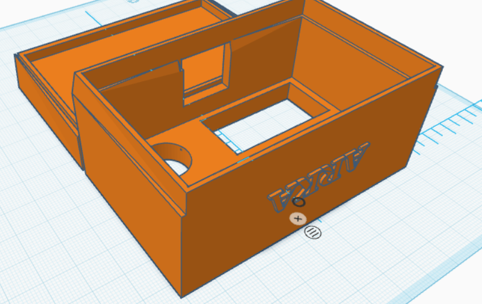
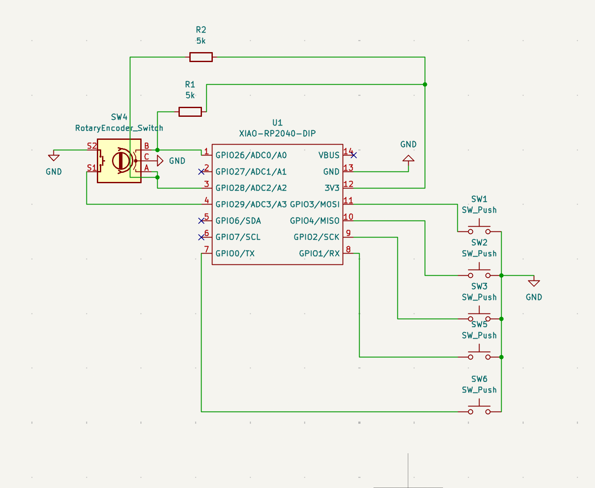
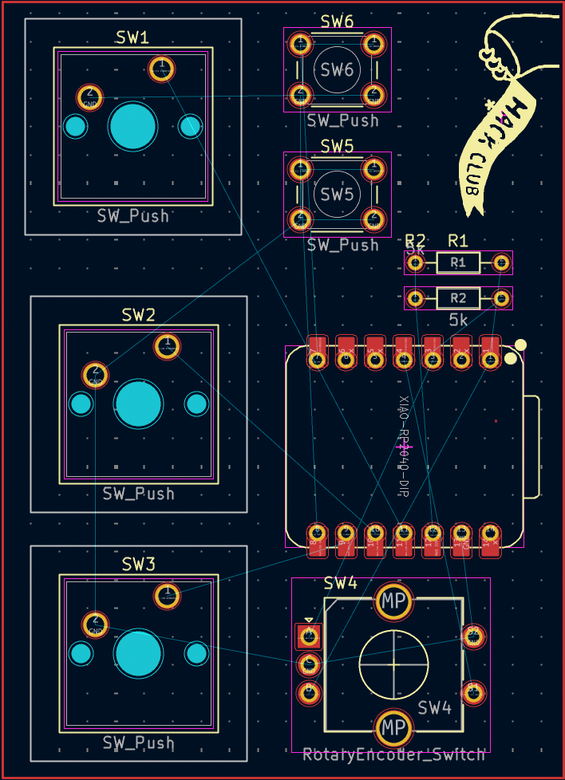

# FootyPad

A custom 4-button mechanical keyboard designed for soccer enthusiasts and gamers. This hackpad features soccer-themed keymaps and macros, perfect for soccer games, streaming, or just showing your love for the beautiful game.

---

## Images

### Assembly
![Assembly Picture] (assets/assembly.png)

### Case (3D Printed)

### Schematic

### PCB Layout

---

## 🛠️ Bill of Materials (BOM)

| Item                | Quantity | Example Part/Notes                | Est. Price (USD) |
|---------------------|----------|-----------------------------------|------------------|
| Microcontroller     | 1        | Raspberry Pi Pico (clone)         | $4.00            |
| Mechanical Switches | 4        | MX-compatible (generic)           | $2.00            |
| Keycaps             | 4        | MX-compatible (blank/generic)     | $1.50            |
| Diodes (1N4148)     | 4        | For switch matrix (if needed)     | $0.20            |
| PCB                 | 1        | Custom, JLCPCB (small batch)      | $2.00            |
| 3D Printed Case     | 1        | PLA, self-printed or service      | $2.00            |
| Header Pins         | 1 set    | For MCU socketing                 | $0.30            |
| Wires/Sockets       | as needed| For connections                   | $0.50            |
| Rubber Feet         | 4        | Optional, for stability           | $0.30            |
| Screws/Standoffs    | as needed| For case assembly                 | $0.50            |

**Estimated Total: $13.30**

*Prices are approximate and may vary by region and supplier. Buying in bulk or using recycled parts can further reduce costs.*

---

