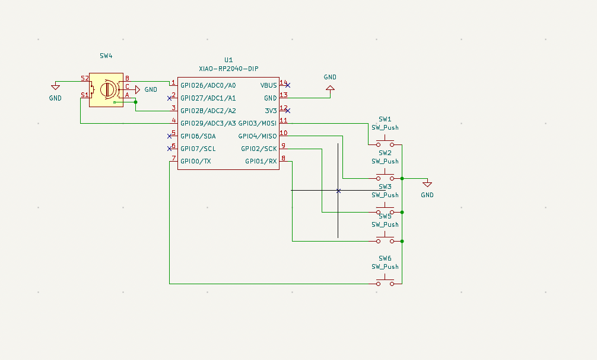
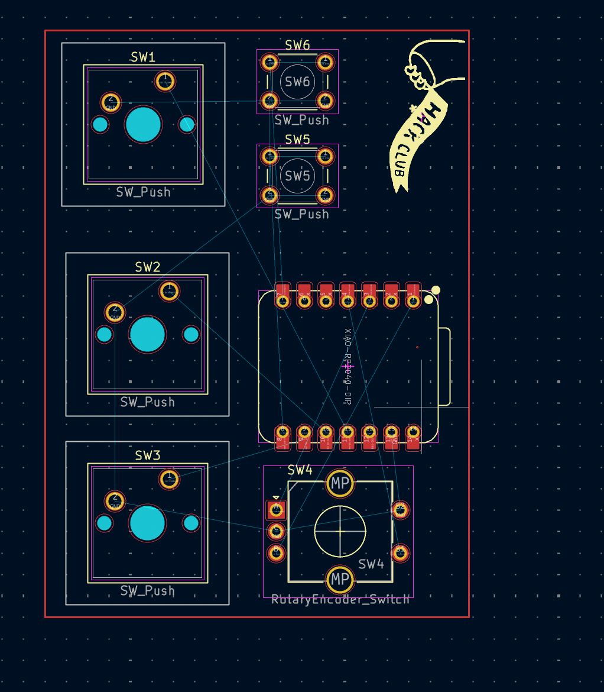

# FootyPad

This hackpad is for soccer players and gamers, something that I am. It is desinged for soccer related games such as FIFA in which the buttons can be used for functions such as moving and scoring goals. I found my inspiration for this hackpad through my love of soccer and the game of FIFA. 

---

## Images

### Assembly

### Case (3D Printed)

### Schematic

### PCB Layout

---

##  Bill of Materials
| Item | Description | Quantity | Size/Package | Purchase Link | Notes |
|------|-------------|----------|--------------|---------------|-------|
| U1 | XIAO RP2040 Microcontroller | 1 | DIP | [Seeed Studio](https://www.seeedstudio.com/XIAO-RP2040-v1-0-p-5026.html) \| [Adafruit](https://www.adafruit.com/product/4900) | Seeed Studio XIAO RP2040 |
| SW1-SW6 | Tactile Push Button Switch | 6 | SW_Push | [Adafruit](https://www.adafruit.com/product/367) \| [SparkFun](https://www.sparkfun.com/products/97) | 6x6mm momentary pushbutton switches |
| SW4 | Rotary Encoder with Switch | 1 | RotaryEncoder_Switch | [Adafruit](https://www.adafruit.com/product/377) \| [SparkFun](https://www.sparkfun.com/products/9117) | EC11 type rotary encoder with integrated pushbutton |
| Enclosure | 3D Printed Housing | 1 | PLA/PETG | [Thingiverse](https://www.thingiverse.com) \| [Printables](https://www.printables.com) | Orange colored housing as shown - STL files needed |
| PCB | Custom PCB | 1 | FR4 | [JLCPCB](https://jlcpcb.com) \| [PCBWay](https://www.pcbway.com) | Custom designed PCB - Gerber files needed |
| Screws | Machine screws | 4-8 | M3 x 6mm | [McMaster-Carr](https://www.mcmaster.com) \| [Amazon](https://www.amazon.com/s?k=M3+screws) | For PCB mounting and enclosure as

