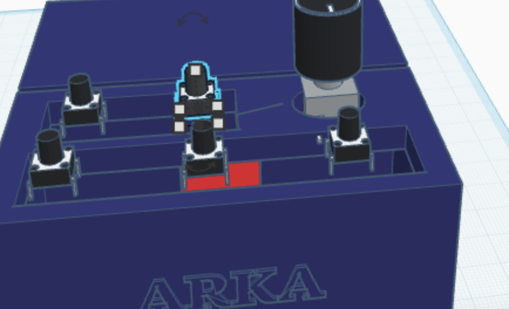

# FootyPad

A custom 4-button mechanical keyboard designed for soccer enthusiasts and gamers. This hackpad features soccer-themed keymaps and macros, perfect for soccer games, streaming, or just showing your love for the beautiful game.

---

## Images

### Assembly

### Case (3D Printed)

### Schematic

### PCB Layout

---

##  Bill of Materials
| **XIAO RP2040** | Microcontroller Board | 1 | Generic/Clone version | $6.50 | [AliExpress](https://www.aliexpress.com/item/1005003928558306.html) \| [Banggood](https://www.banggood.com/XIAO-RP2040-p-1914578.html) |
| **Push Button Switches** | 6x6mm Tactile Switches | 5 | Bulk pack (50pcs) | $2.00 | [AliExpress](https://www.aliexpress.com/item/32697109472.html) |
| **Rotary Encoder** | KY-040 Rotary Encoder | 1 | Basic module | $1.50 | [AliExpress](https://www.aliexpress.com/item/1859136395.html) |
| **Resistors** | 5kΩ Resistors | 2 | From resistor kit/bulk | $0.20 | [AliExpress](https://www.aliexpress.com/item/32952657927.html) |
| **Custom PCB** | 2-layer PCB | 1 | JLCPCB 5pcs minimum | $2.00 | [JLCPCB](https://jlcpcb.com/) (with coupon) |
| **Pin Headers** | Female headers | 1 set | Generic 40-pin strip | $0.50 | [AliExpress](https://www.aliexpress.com/item/32724478308.html) |
| **DIY Cardboard** | Cardboard + hot glue | $0.00 | Use shipping boxes you have |
| **Acrylic Sheets** | Laser-cut or hand-cut | $3.00 | [Amazon acrylic sheets](https://www.amazon.com/dp/B01M0CCQPB) |
| **3D Print Service** | Online printing service | $4.00 | [Craftcloud](https://craftcloud3d.com/) basic PLA |
| **USB-C Cable** | Programming cable | $1.50 | [AliExpress](https://www.aliexpress.com/item/1005001621837476.html) |
| **M3 Screws** | Case screws (if needed) | $1.00 | [AliExpress hardware kit](https://www.aliexpress.com/item/32967909123.html) |

